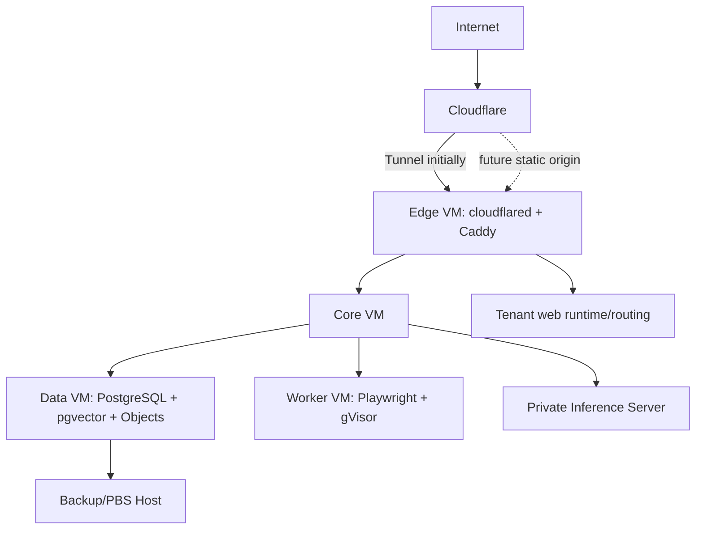
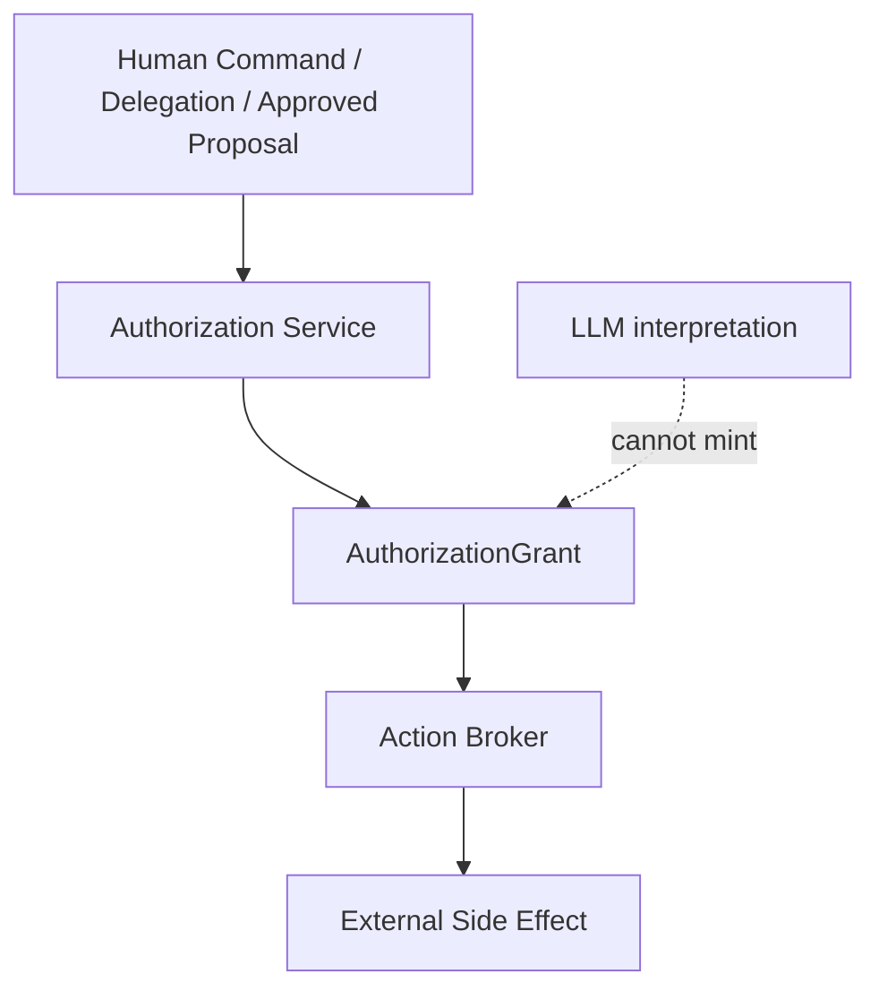

# Architecture Diagrams

## Logical request/action path

```mermaid
flowchart LR
  H[Human] --> UI[Voice / Text / UI]
  UI --> C[Conversation Shell]
  C --> I[Intent Resolver]
  I --> A[Authority Resolver]
  A --> D[Director Agent]
  D --> W[Temporal Workflow]
  W --> S[Skill Runtime]
  S --> R[Capability Resolver]
  R --> T[AI / Tools / Media]
  T --> AB[Action Broker]
  AB --> P[Policy + Authorization + Risk + Entitlement]
  P --> X[Connector / Provider]
  X --> EW[External World]
```

## Infrastructure

```mermaid
flowchart TD
  INET[Internet] --> CF[Cloudflare]
  CF -->|Tunnel initially| EDGE[Edge VM: cloudflared + Caddy]
  CF -. future static origin .-> EDGE
  EDGE --> CORE[Core VM]
  EDGE --> RUNTIME[Tenant web runtime/routing]
  CORE --> DATA[Data VM: PostgreSQL + pgvector + Objects]
  CORE --> WORKER[Worker VM: Playwright + gVisor]
  CORE --> GPU[Private Inference Server]
  DATA --> PBS[Backup/PBS Host]
```

## Authority

```mermaid
flowchart TD
  CMD[Human Command / Delegation / Approved Proposal] --> AUTH[Authorization Service]
  AUTH --> GRANT[AuthorizationGrant]
  MODEL[LLM interpretation] -. cannot mint .-> GRANT
  GRANT --> BROKER[Action Broker]
  BROKER --> EXT[External Side Effect]
```
